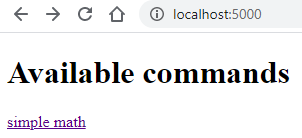
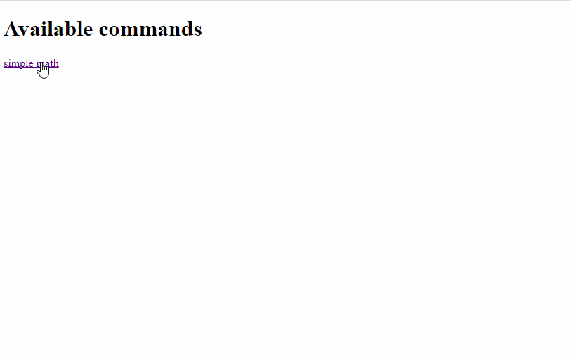

# argparse2HTML

## Features
* Converts an `argparse.ArgumentParser` object into a GUI/HTML input form.
* Arbitrary Python functions can be executed asynchronously via a simple web interface
* Hot swapping of functions/parser possible
* Execution via `subprocess` or `celery`
* Runs on Linux and Windows
* Automatic translation of `ArgumentParser` attributes in GUI elements
  * `choices` become radio buttons
  * `type=int` becomes numeric only input form
  * `help` text is shown in hover info
  * `default` values are applied

## Usage

*  Create a function which takes a `ArgumentParser` namespace as its input and a corresponding `ArgumentParser` object 
  ```
  # our function which needs a GUI                    
  def simple_math(args):
      vals = [args.x, args.y]
      f = getattr(builtins, args.action)
      return f(vals)

  # our ArgumentParser
  parser = argparse.ArgumentParser(prog='simple math', description='a simple math command line interface')
  parser1.add_argument('x', help='first value',
                       default='2',
                       type=int)
  parser1.add_argument('y', help='second value',
                       default='3',
                       type=int)
  parser1.add_argument('--action', help='which method to apply',
                       default='min', choices=['min', 'max', 'sum'],
                       type=str)

  ```

* Import the function in `args.py`

  ```
  from example_argparser import parser1, simple_math
  ```
* Add it to the `parsers` in `args.py`
  ```
  parsers = [Parser(name=parser1.prog,
                    parser=parser1,
                    function=simple_math)
            ]
  ```

* Start the Flask webserver

  ```
  python server.py
  ```
* All your registered functions/argparsers are available

  

* Execute the Python script

  


## Configuration

* Modify `config.py`
  * `USE_CELERY`: if `True` celery is used for starting jobs
  * `JOB_FOLDER`: where your job results and log files are stored
  * `SERVER_PORT`: on which port the server is listening
  
* Register your Python functions and parsers in `args.py`
* Hot-swap them by opening `/refresh`
    


